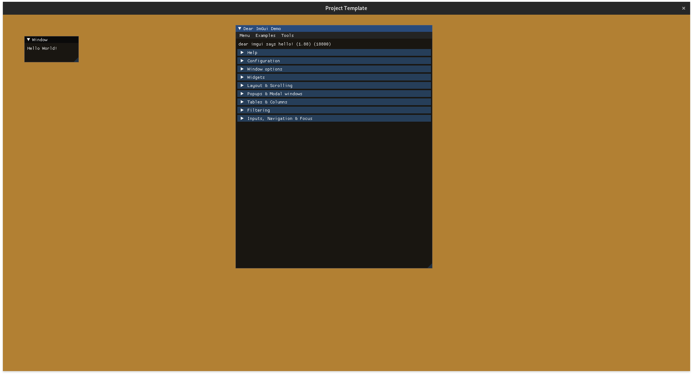

# CMake-Glfw-OpenGL-Template

## What is this?

CMake based C++ Project template with support for glfw, glad, imgui, spdlog, tracy

This template is split into three parts

`Project` and `Project.Library` and `lib`

`Project` will be your actual project/game,
`Project.Library` containing supporting functions, things you might be reusing for something else. It could also contain your graphics/game engine abstractions.

This template provides a basic `Application` base class, ready to go, including window creation via `glfw`, hooking up `OpenGL` via `glad`, preparing UI rendering via `dear imgui`, logging via `spdlog` and comes with profiler capabilities via `tracy` too.

`lib` contains the list of dependencies used by projects across the solution, in this case, `imgui`, `spdlog`, `glm` and `tracy`

## For whom is this for?

- Prototyping
- Game Jams
- Getting started with programming
- Getting started with graphics programming

## What do you need?

- `CMake`
- for VSCode the `CMake Tools` extension from Microsoft
- a compiler of your choice (Clang, GCC, MSVC)

## Assumptions

This project template assumes the following things

- OpenGL 4.6 support (can be changed in `Application.cpp:59-60`)
- Resolution >= 1920x1080 so that you can actually use the window (can be changed in `Application.cpp:66-67`)

## What's next?

You most likely dont want to name your program `Project` and or `Project.Library`. Use your favorite search tool and replace `Project.Library` with `UE6.Engine` and `Project` with `UE6` :)